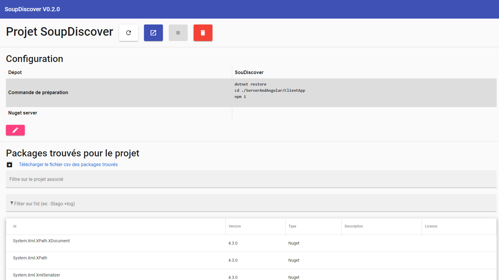

# SoupDiscover
This application allows you to extract all the packages as well as the associated metadata.
It searches for Nuget and NPM packages.



# Build and execute

## With Docker

```bash
# Build project
docker build . -t soupdiscover:latest

# Run with sqlite
docker run -d -P soupdiscover:latest

# Run with Postgres
docker run -d -P -e DatabaseType=Postgres -e "ConnectionString=Server=FRSPRSQL100; Port=5432; Database=SoupDiscover; User Id=SoupDiscover; Password=*********;" soupdiscover:latest
```

## Locally

```bash
# Compil
dotnet build SoupDiscover.csproj

# Execute
dotnet ServerAndAngular\bin\Debug\net5.0\SoupDiscover.dll
```

# Environment variables

If application is running in a docker, it can be configured through environment variables.

| Variable name | Description | Default value |
|---|---|---|
| __TempWork__ | The directory where deploying repositories. | This folder is temporary, to restore packages.  |
| __ConnectionString__ | String connection for the database | `Data Source=CustomerDB.db`  |
| __DatabaseType__  | Database type. Supported database types : "SQLite" and "Postgres" | `SQLite` |

# Settings of appsetting.json
:construction_worker:

